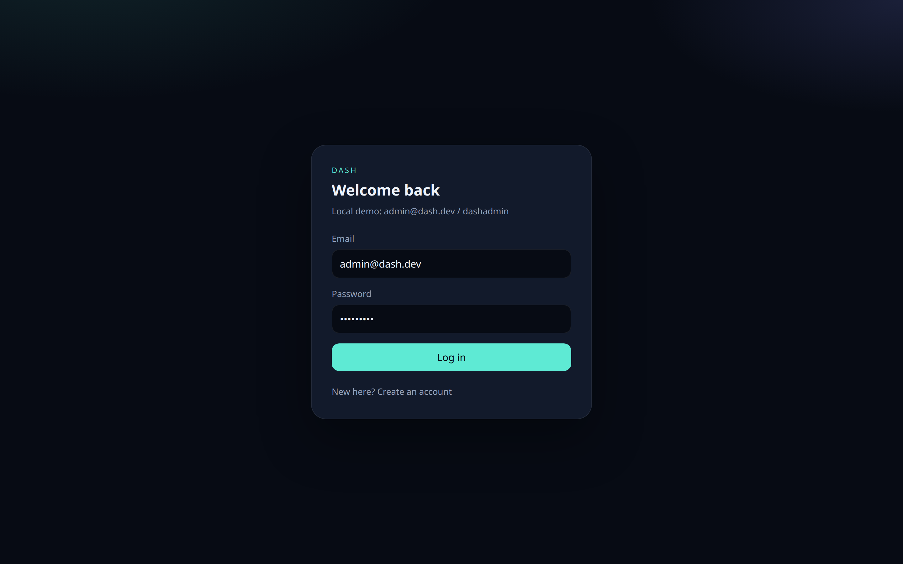
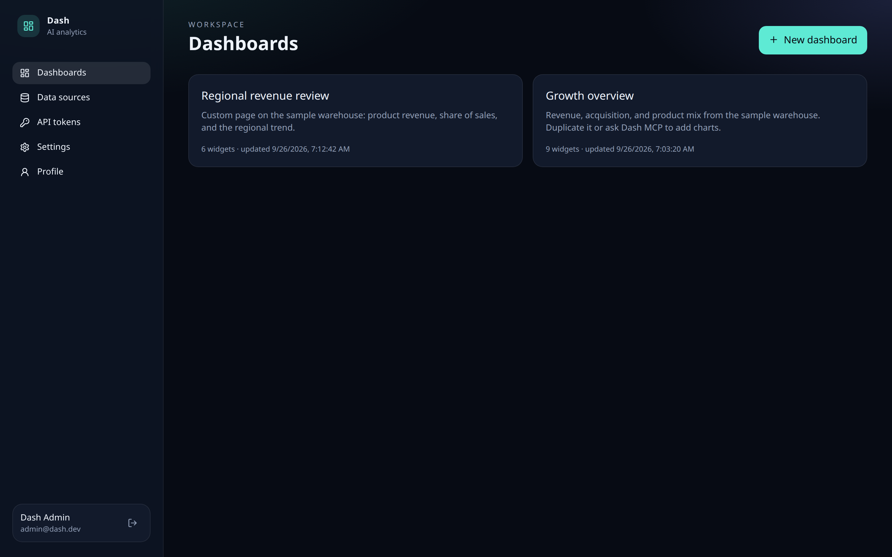
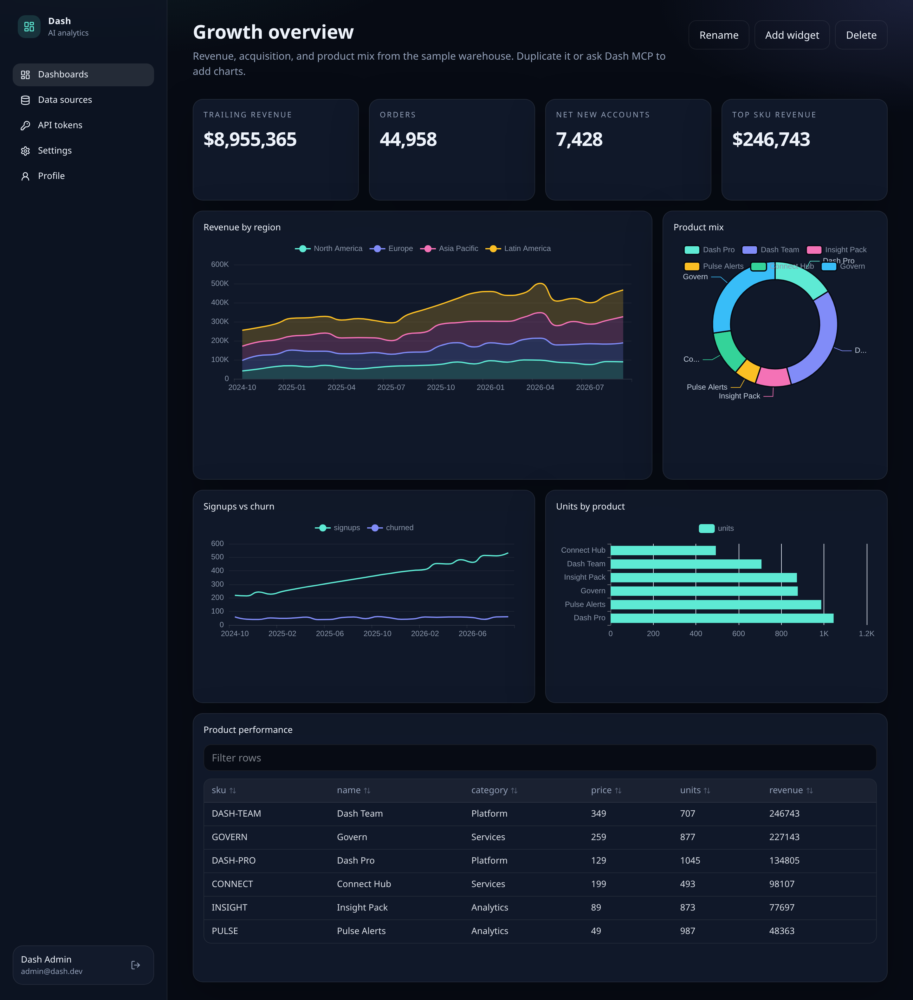
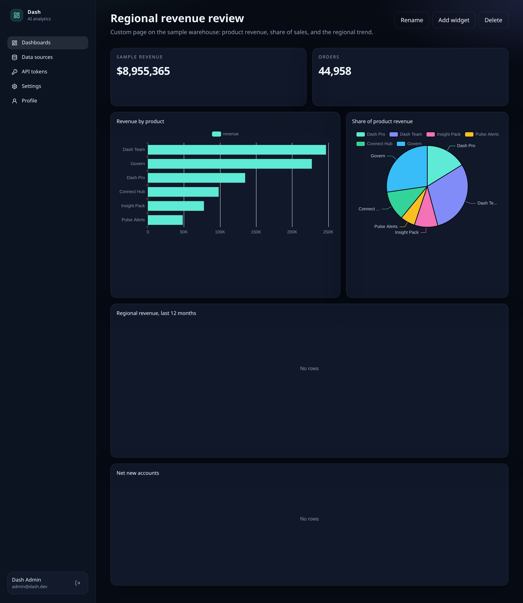
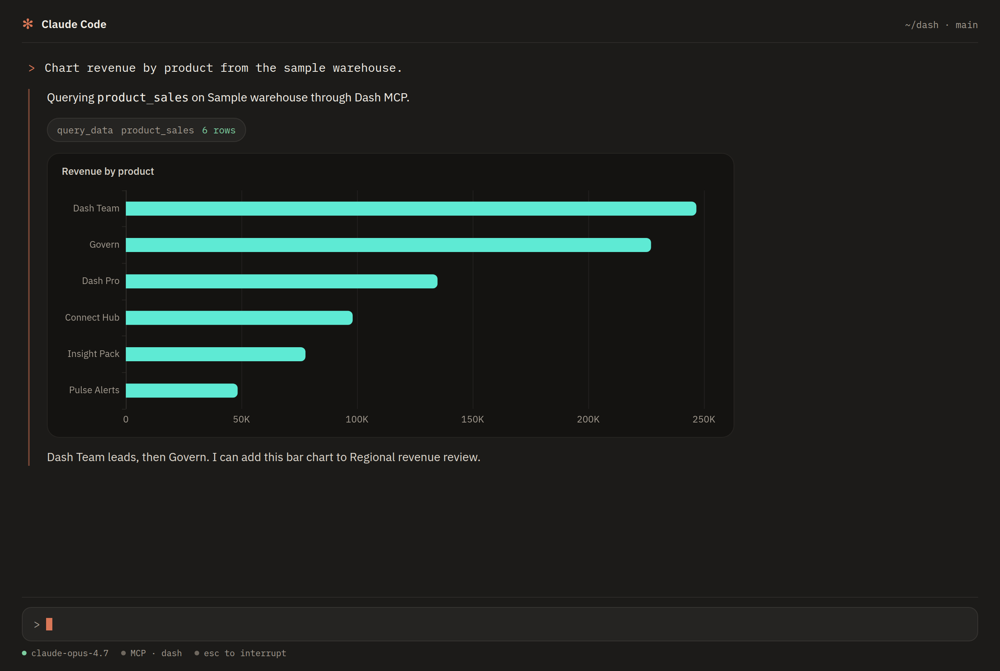
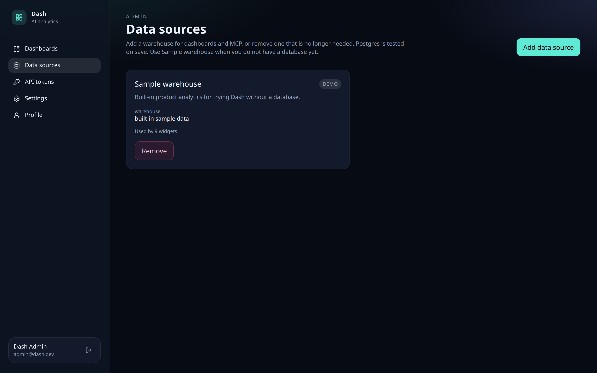
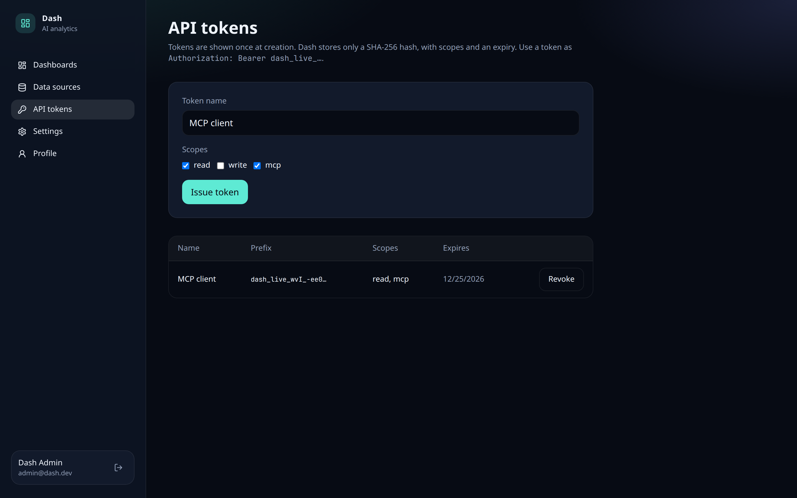
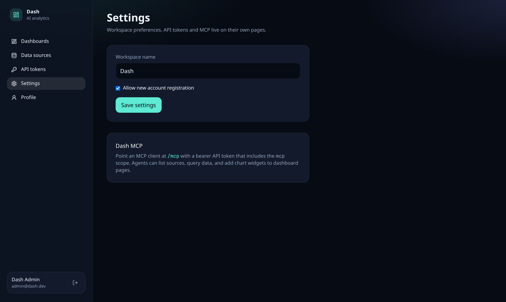
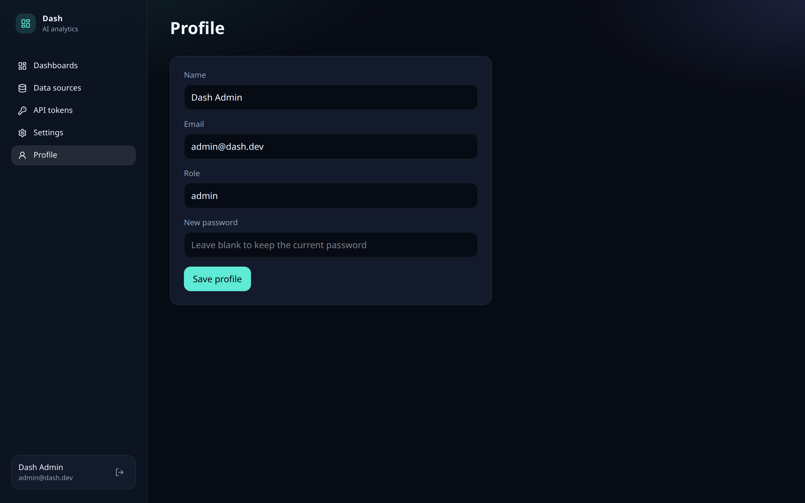

# Dash

AI-first analytics: dashboards, charts, and data sources you can drive from the UI or from [MCP](https://modelcontextprotocol.io).

Dash is a modern Tableau / Looker-style workspace. Agents can list warehouses, run structured queries, and add chart widgets to dashboard pages through the built-in MCP server.

## Screenshots

Taken from the demo workspace (`admin@dash.dev`). The sample warehouse ships with a **Growth overview** page. **Regional revenue review** is a custom page on the same data.

### Sign in

`/` opens this page until you are signed in. A signed-in visit goes straight to dashboards.



### Dashboards



### Growth overview

KPI tiles, a stacked revenue area chart, product mix, signups versus churn, units by product, and a filterable product table.



### Regional revenue review

A custom page: product revenue, share of sales, the regional stack for the last 12 months, and net new accounts.



### In Claude Code

The same product-revenue chart, drawn in the session after a Dash MCP query against the sample warehouse.



### Data sources



### API tokens



### Settings



### Profile



## Requirements

- [Node.js 24](https://nodejs.org/) (Active LTS)
- [pnpm](https://pnpm.io/) 12 (pinned to 12.5.1 in `package.json`)

## Monorepo

```text
core/                      @dash/web        UX + REST API + MCP (TanStack Start)
packages/core/             @dash/core       Shared types and adapter interfaces
data-adapters/postgres/    @dash/adapter-postgres
```

Workspaces are declared in `pnpm-workspace.yaml`.

## Quick start

```bash
pnpm install
cp .env.example .env
pnpm dev
```

Open [http://localhost:3000](http://localhost:3000). The demo seed creates:

| | |
| --- | --- |
| Email | `admin@dash.dev` |
| Password | `dashadmin` |

Change `DASH_SECRET` before exposing the app. Set `DASH_SEED_DEMO=false` to skip the demo user and sample warehouse.

## Feature checklist

Keep this list in sync as PRs land. Checked items are in the tree today.

### Platform

- [x] PNPM workspace monorepo
- [x] Node.js 24
- [x] Core types package (`@dash/core`)
- [x] Data adapter interface (`DataAdapter`)
- [x] Postgres adapter (`@dash/adapter-postgres`)
- [ ] MySQL adapter
- [ ] MongoDB adapter
- [ ] Google BigQuery adapter
- [ ] Snowflake adapter
- [ ] Redshift adapter
- [ ] ClickHouse adapter

### UX

- [x] Login and registration
- [x] User profile
- [x] Settings
- [x] Dynamic dashboard pages
- [x] Chart widgets (TanStack Charts)
- [x] Sortable and filterable tables (TanStack Table)
- [x] Data sources page (admin): add and remove sources (demo warehouse + Postgres)
- [ ] Real-time multi-user dashboard collaboration
- [ ] Light theme

### API and agents

- [x] REST API
- [x] Session authentication (httpOnly cookie)
- [x] API tokens (hashed, scoped, expiring, revocable)
- [x] MCP server (`POST /mcp`) for charts and dashboards
- [ ] OAuth for MCP clients

## REST surface

All routes except register/login require a session cookie or `Authorization: Bearer dash_live_…`.

| Method | Path | Notes |
| --- | --- | --- |
| POST | `/api/auth/register` | First user becomes admin |
| POST | `/api/auth/login` | Sets `dash_session` |
| POST | `/api/auth/logout` | |
| GET | `/api/auth/me` | |
| PATCH | `/api/users/me` | Profile / password |
| GET/PATCH | `/api/settings` | PATCH is admin-only |
| GET/POST | `/api/data-sources` | POST is admin-only |
| GET/PATCH/DELETE | `/api/data-sources/:id` | |
| GET | `/api/data-sources/:id/schema` | |
| POST | `/api/data-sources/:id/connect` | Connection test |
| POST | `/api/data-sources/:id/query` | Structured query |
| GET/POST | `/api/dashboards` | |
| GET/PATCH/DELETE | `/api/dashboards/:id` | |
| GET/POST | `/api/tokens` | Session only; token value shown once |
| DELETE | `/api/tokens/:id` | Revoke |
| GET/POST | `/mcp` | Bearer token with `mcp` scope |

## MCP

Issue a token with the `mcp` scope, then point a client at `/mcp`. Tools include `list_data_sources`, `get_schema`, `query_data`, `list_dashboards`, `get_dashboard`, `create_dashboard`, and `add_chart_widget`.

## Scripts

| Command | |
| --- | --- |
| `pnpm dev` | Start `@dash/web` |
| `pnpm test` | Run package tests |
| `pnpm typecheck` | TypeScript across workspaces |
| `pnpm build` | Production build |

## Architecture notes

- [ADR 0001](docs/adr/0001-monorepo-architecture.md) — workspace layout
- [ADR 0002](docs/adr/0002-charting-library.md) — original ECharts renderer (superseded)
- [ADR 0004](docs/adr/0004-tanstack-charts.md) — TanStack Charts + `ChartSpec`
- [ADR 0003](docs/adr/0003-api-tokens.md) — sessions, tokens, encryption

## License

MIT. See [LICENSE](LICENSE).
